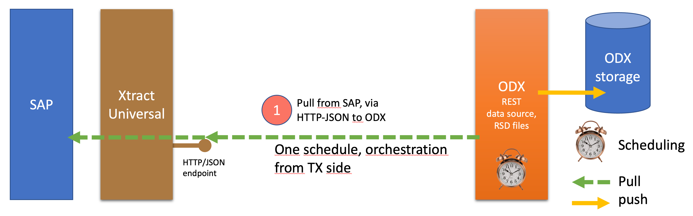

# RSD file generator for Xtract Universal

## Table of Contents

1. [Compatibility](#compatibility)
2. [About](#about)
3. [Getting Started](#getting-started)
   1. [Prerequisites](#prerequisites)
   2. [Installing](#installing)
4. [Usage](#usage)

## Compatibility

* Xtract Universal version `6.3.0` to `6.3.4`: [Download](./archive/bb26400800051323e4ddffa19d73f3a7b0b57938.zip)
* **All other versions: [Download](./archive/refs/heads/main.zip)**

## About

To extract data from SAP using [TimeXtender](https://timextender.com), the best approach is to use [Theobald Xtract Universal](https://theobald-software.com/en/xtract-universal/) with their proven technology and performance. To get the data to TimeXtender's Operational Data Exchange (ODX) seamlessly and without data duplication, Xtract Universal provides http-json endpoints, and also metadata discovery endpoints.

To make the [extractions](https://help.theobald-software.com/en/xtract-universal/getting-started/define-a-table-extraction) created in Xtract Universal known to the ODX, RSD files are needed, that point ODX to the right URL, list the [columns and data types](https://cdn.cdata.com/help/DWH/ado/pg_APIinfo.htm#input-output-and-column-parameters) available in each table.

This [knowledge base article explains the whole setup process](https://support.timextender.com/data-sources-112/theobald-xtract-universal-839).

This RSD-generator helps to make the process of generating these RSD files easier - by reading the metadata provided by Xtract Universal and enhancing a given rsd template with the schema metadata.



From TimeXtender with :chart_with_upwards_trend:, :brain: & :heart:

## Getting Started

### Prerequisites

Your machine should have

- access to Xtract Universal (can be installed on the same machine, or on another reachable machine)
- At least one **SAP source** configured in Xtract Universal
- At least one **extraction** configured in Xtract Universal
- [Python 3](https://www.python.org/downloads/) installed

### Installing

1. Download and extract this repository to a local folder (or use `git clone` to create a local copy)
2. Open a command window in the folder
3. Create a Python environment

   ```cmd
   python -m venv .venv
   ```

4. Activate the Python environment

   ```cmd
   .\.venv\scripts\activate
   ```

5. Install required Python packages (`requests` & `python-dotenv`)

   ```cmd
   .\.venv\scripts\pip install -r requirements.txt
   ```

6. Copy or rename `.env.example` to `.env`
7. Adjust parameters in `.env` file:
   - `XU_BASE_URL` - point to the root endpoint of your Xtract Universal installation
   - `RSD_TARGET_FOLDER` - point to the folder where your RSD files should be created

> `install.bat` will cover steps 1-6, just execute it, and skip to step 7.

## Usage

```cmd
.\.venv\scripts\python.exe main.py
```

or alternatively execute `run.bat` in a command window within the folder.

